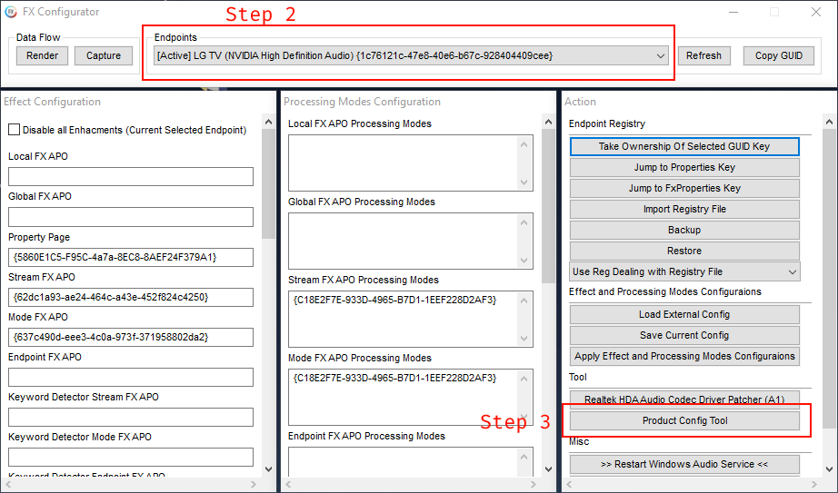
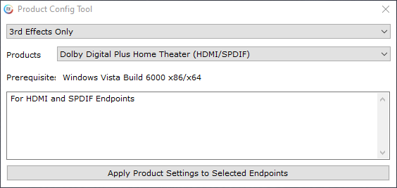
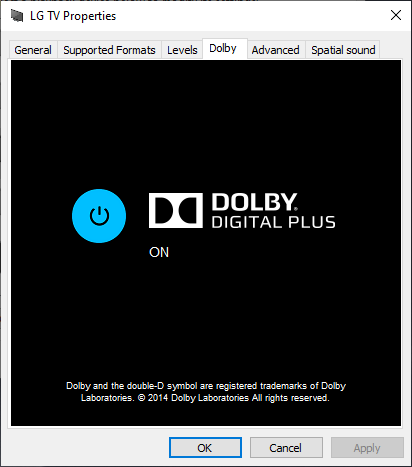
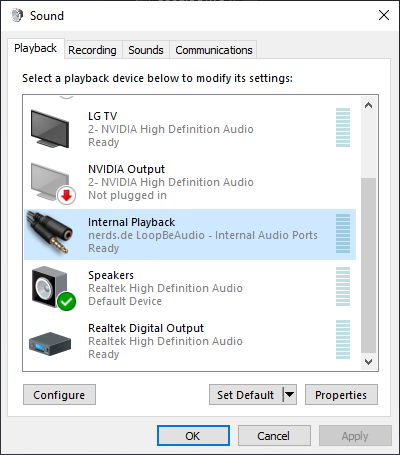
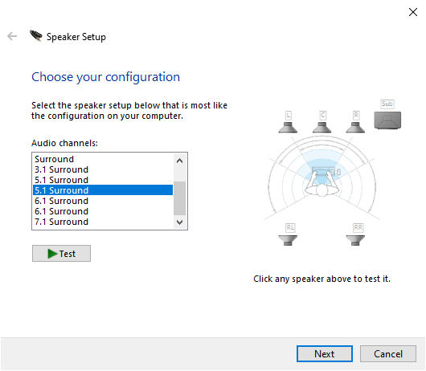
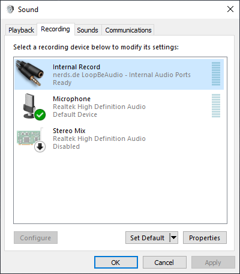
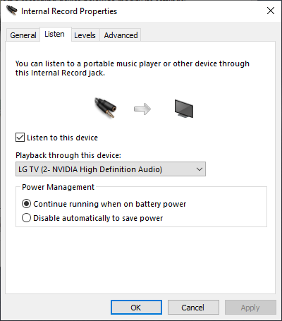
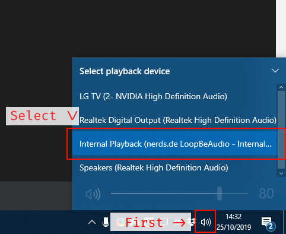
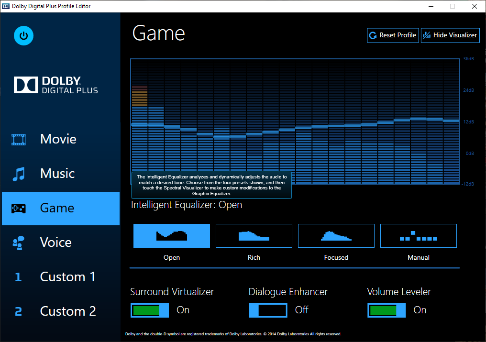

# Sonos surround sound on Windows and games
This step-by-step guide explains how to get Dolby Digital 5.1 surround sound working on your Sonos soundbar with rear speakers and subwoofer.

Should work with Sonos Beam, Sonos Playbar and Sonos Playbase.

Please make sure that surround sound is already working with other content on your television. [Download test video files](https://thedigitaltheater.com/dolby-trailers/) Make sure the audio format is *Dolby AC3 5.1 640 kbps*.

## Tested environment
- Sonos Beam soundbar connected to PC via NVIDIA HDMI with 2 Sonos One rear speakers and a Sonos Sub *
- Television: LG OLED55C7V
- Windows 10 x64 version 1903 (18362.418)
- APO Driver 2.6.2.7 x64
- LoopBeAudio 1.2 (licensed)
- NVIDIA graphics card

I recommend to try newer versions of both APO Driver and LoopBeAudio when available.

\* Various other audio setups should work as well, such as using Symfonisk rear speakers. This guide should also work with optical output.

## Step-by-step guide
#### Install APO Driver
[Download APO Driver](https://waa.ai/apodriver) and install the x64 version with **only** these features enabled:
* FX Configurator
* Dolby DS1

#### FX Configurator setup
The APO Driver allows us to enable Dolby Digital on any sound endpoint device, such as the HDMI output of your graphics card or your optical output.

1. Start the *FX Configurator* program via the start menu.

2. At the top of the window is a list of devices: Select the endpoint device you want to enable surround sound for. This is usually your TV. Also make sure the TV is turned on and shown as *Active* in the list.
3. Click on the *Product Config Tool* button. This opens a new window.

4. Set *Products* to *Dolby Digital Plus Home Theater (HDMI/SPDIF)*.
5. Click the *Apply Product Settings to Selected Endpoints* button and wait a few seconds.

#### Endpoint sound settings
1. Open the Windows sound settings by pressing the *Windows + R keys*. Then type in `mmsys.cpl` and press enter or click *OK*.
2. Right-click on the endpoint and click *Properties*.
3. There should be a *Dolby* tab. Click it and make sure Dolby is turned on.

4. Click on the *Advanced* tab and set the *Default Format* dropdown to *Dolby Digital*.
(Clicking *Test* won't work yet. Do not set the format to Dolby Atmos.)
5. Click on *OK*.

#### LoopBeAudio setup
[LoopBeAudio](https://nerds.de/en/loopbeaudio.html) is a great tool which simulates a 5.1 surround sound setup. This will make sure all programs and games will output surround sound. The downside is that it's a paid program, albeit not expensive. [Free trial version](https://nerds.de/en/download.html) (with 60 minute timer which resets on every Windows reboot) is also available to try.

1. Install *LoopBeAudio*. It's not necessary to read the manual.
2. Open the Windows sound settings by pressing the *Windows + R keys*. Then type in `mmsys.cpl` and press enter or click *OK*.

3. Right-click on *Internal Playback* and click *Configure Speakers*.

4. Select the *5.1 Surround* option. Make sure you select the variant where the rear speakers are behind you. (Clicking *Test* still won't work. Other surround setups might work as well. However, I've not tested this.) 
5. Click *Next* a couple of times and leave the checkboxes at the default state.
6. When the *Configuration complete* step is shown, click *Finish*.
7. Back in the Windows sound settings window click on the *Recording* tab.

8. Right-click on *Internal Record* and then click on *Properties*.
9. In the opened *Internal Record Properties* window click on the *Listen* tab.

10. Check *Listen to this device* and select your endpoint device in the *Playback through this device* dropdown.
11. Click *OK*.

#### Set output to *Internal playback*
We're almost done!

If you intend on using your television speakers at all times then you can right-click on the *Internal playback* (in the *Playback* tab) and click *Set as Default Device*.

**OR**

In more recent Windows 10 versions you can select sound devices from the taskbar. This means you can switch to *Internal Playback* whenever you'd want.

**!!! Make sure to somewhat lower the volume of *Internal Playback* and/or your endpoint !!!**

#### Time to test
[Open this Fraunhofer.de web page](https://www2.iis.fraunhofer.de/AAC/multichannel.html) and scroll to *HE-AAC Channel ID - With H.264 Video*. Play the video and the audio should be in surround. :)

While playing sound you can check the Sonos app (Android or iOS) whether it's working correctly: Open the *Settings* tab > Tap *System* > Tap *About My System* > scroll to *Beam*/*Playbar*/*Playbase* and make sure *Audio in* shows *Dolby Digital 5.1*.

#### Game support
Lots of PC games have surround support. Usually it'll work out-of-the-box but in some cases you have to set the ingame sound settings to *Surround*.
Not sure if a game has surround support? Look up the game on [PCGamingWiki](https://www.pcgamingwiki.com/wiki/Home) and it's usually mentioned in the audio support table.

#### *Optional:* Equalizer (fine-tune sound)
The *Dolby Digital Plus HT* tool is optional but may improve the sound quality. You can compare it to Sonos' own *Loudness* option.

1. Install the [*Dolby Digital Plus HT* tool](http://www.mediafire.com/file/axqb6b6nfthvnzx/DolbyDigitalPlusHT.msi/file).
2. Start *Dolby Digital Plus* program from start menu.

3. I recommend setting the tab to *Game* and then select the *Open* or *Rich* preset.

#### Problems? Feedback? Download links broken?
Either post a GitHub issue or send me an email: [sonossurroundsoundplease@kapite.in](mailto:sonossurroundsoundplease@kapite.in)
